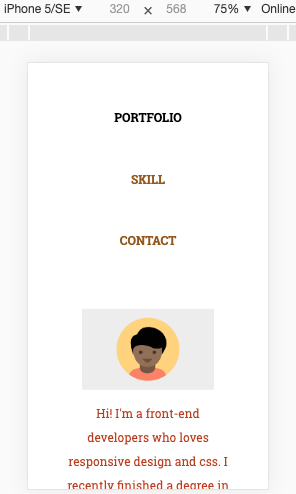
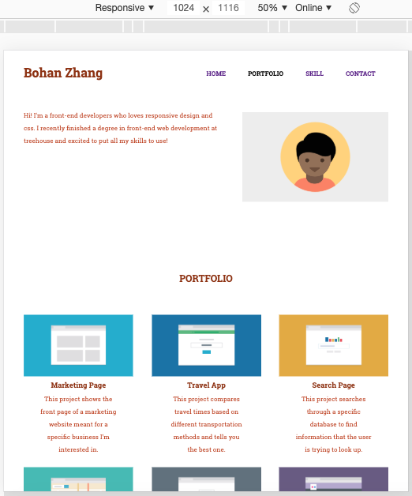
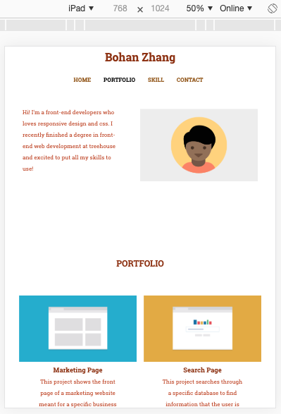

# responsive_layout_treehouse
**responsive_layout_treehouse** 

This is a website made with mobile first apporaching!

The media-query divided into 320px, 768px, and 1024px.

You can visit the live version at [https://allan9595.github.io/responsive_layout_treehouse/](https://allan9595.github.io/responsive_layout_treehouse/)

## How to run on the local machine

git clone https://github.com/allan9595/responsive_layout_treehouse.git

Go to the folder then open the index.html file in browser. 

## Screenshots

